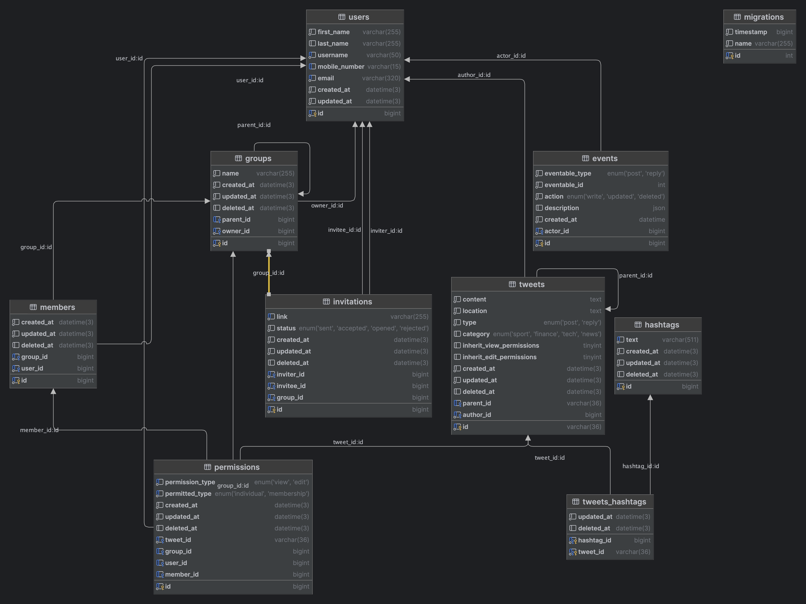

# RESTful API for ACL Management with NestJS, Docker, and MySQL

This project demonstrates how to handle Access Control Lists (ACL) in large-scale projects like Twitter. It focuses on
combining grouping and permissions to create a scalable and flexible solution.

For more information or to connect with the author,
visit [Mohammad Hassan Daneshvar's LinkedIn profile](https://www.linkedin.com/in/mohammad-hassan-daneshvar/).

---

## Overview

In ACL-based projects, the main components are:

- **Users**
- **Contents**
- **Permissions**

The goal is to control user access to published content using a set of rules.

In our proposed solution, user access to tweets is managed through the `permissions` table. Permissions can include
viewing and editing capabilities. If no specific permissions are found for a tweet, it is considered public, accessible
by everyone, with only the author able to edit it.

---

## Key Features



### 1. Adding Users to Groups

- Users can create multiple groups.
- Groups can be nested under other groups created by the same author.
- After creating groups, users can invite others to join them.
- Invitees can view, accept, or reject invitations.
- Once accepted, the invitee becomes a **member** of the group.

Refer to the **Authors/Groups** folder in the attached Postman collection for detailed examples.

---

### 2. Configuring Access Control

When creating a tweet, access rules can be defined as follows:

```json
{
  "parent_id": "71960fa7-9801-4d5d-8ae5-3713d7108688",
  "location": "London, UK",
  "content": "Lorem ipsum dolor sit amet, consectetur adipiscing elit.",
  "category": "SPORT",
  "hashtags": [
    "london",
    "lorem",
    "ipsum"
  ],
  "permissions": {
    "inherited": {
      "view": true,
      "edit": true
    },
    "view": {
      "users": [
        10,
        20
      ],
      "groups": [
        2,
        7,
        9001
      ]
    },
    "edit": {
      "users": [
        4,
        5
      ],
      "groups": []
    }
  }
}
```

#### Inheritance:

- If a tweet has a parent tweet, access settings can inherit permissions (`inherited` flag).
- If no inheritance is specified (or no parent exists), the `view` and `edit` properties in `permissions` determine
  access.

#### Permissions Example:

```json
"permissions": {
"view": {
"users": [10, 20],
"groups": [2, 7, 9001]
},
"edit": {
"users": [4, 5],
"groups": []
}
}
```

- **Viewing Permissions:** Users `10`, `20` and members of groups `2`, `7`, `9001` can view this tweet.
- **Editing Permissions:** Only users `4` and `5` can edit this tweet.

---

## Project Architecture

Due to the complexity of the business logic, a **domain-centric approach** was adopted. Concepts of **Domain-Driven
Design (DDD)** were implemented as much as time allowed.

### Hexagonal Architecture:

- Emphasized separation of primary and secondary adapters.
- This approach ensures:
    - Clear boundaries for the domain layer.
    - Flexibility to switch between RESTful APIs, GraphQL, or even message brokers with minimal changes.

---

## Tools and Technologies

- **Framework:** [NestJS](https://nestjs.com/)
- **Database:** MySQL (via Docker)
- **Containerization:** Docker

---

## Getting Started

### Prerequisites

1. Clone the repository.
2. Copy the `.env.example` file to `.env`:
   ```bash
   cp .env.example .env
   ```

### Steps to Run

1. Navigate to the `cicd/dev` directory.
2. Build and run the application with Docker Compose:
   ```bash
   docker-compose up --build
   ```
3. Start the application in development mode:
   ```bash
   pnpm run start:dev
   ```
4. Run database migrations to set up the schema:
   ```bash
   pnpm run migrations
   ```
5. Add sample users to the `users` table for testing purposes.

---

## Testing the API

- The **Postman collection** and its related environment file are included in the `documents` directory.
- Import these files into Postman to test the API endpoints seamlessly.

---

For further inquiries or to connect, feel free to reach out
via [LinkedIn](https://www.linkedin.com/in/mohammad-hassan-daneshvar/).

---